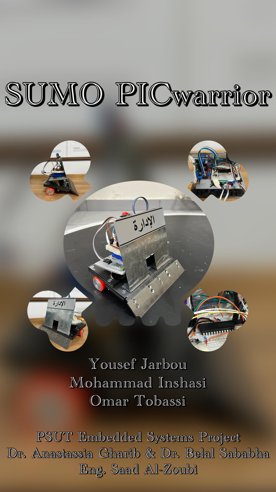
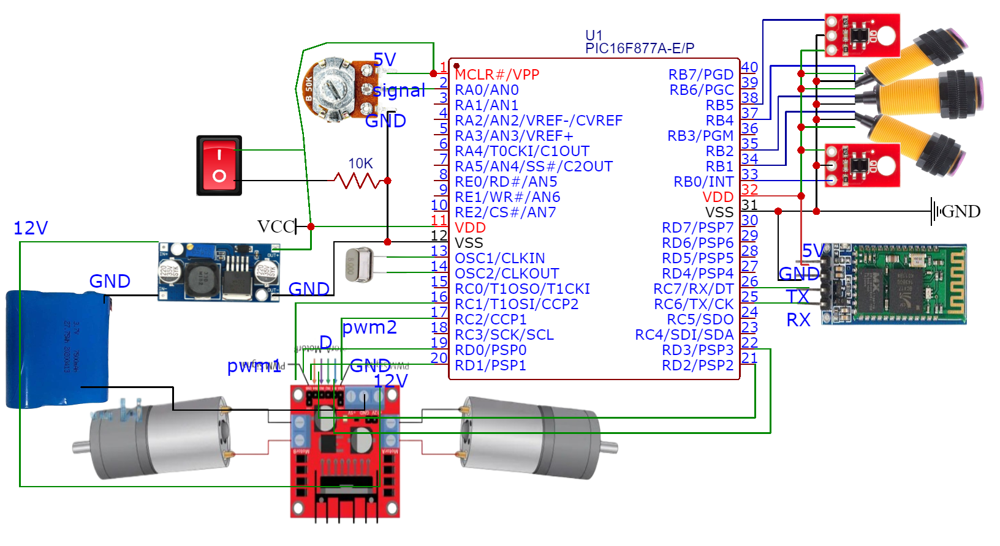

# Sumo PICwarrior
Welcome to the Sumo PICwarrior project! This repository houses the source code and documentation for our autonomous sumo wrestling robot, powered by the PIC16F877A microcontroller. What sets our project apart is its dual control modes: first, it can be remotely controlled via Bluetooth for real-time manual precision, and second, it exhibits autonomy using onboard sensors, including infrared and proximity sensors, enabling independent decision-making. The repository includes the PIC16F877A source code, hardware specifications, and documentation. 

  

# Table of Contents
- [Requirements](#requirements)
- [Hardware Setup](#hardware-setup)
- [Software Setup](#software-setup)
- [Other](#other)

# Requirements
- PIC16F877A microcontroller
- Sensors (3 IR sensors, 2 line sensors)
- 2 Motors
- Motor Driver(H-Bridge)
- Potentiometer
- Bluetooth HC-06
- CRYSTAL Oscillator
- 12V Battery
- EasyPIC to test

# Hardware Setup

# Software Setup
- Press here to redirect to Our
 [Code](Sumo)

# Other
